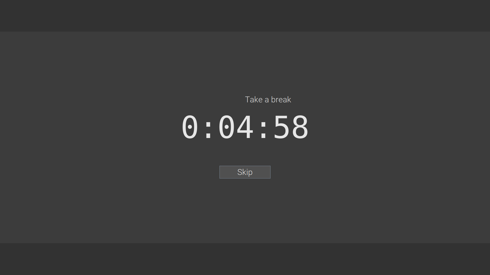

# BreakTime

_a.k.a. Take a break_

I wrote this software to force myself to take breaks at regular intervals when working on the computer. 

The user can choose a specific amount of time he/she wants to use the computer before being forces to take a break. Using a full screen blocker, the user cannot use the computer when this time has passed. Only after a certain amount of break time (default is 5 minutes), the user can request some computer time again. 

This solution is not fully foul proof, but I strive to secure the lock screen as good as I can.

